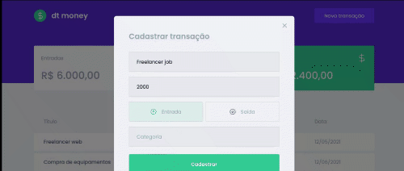

# dt money
Uma aplicação que ajuda o usuário a controlar suas finanças! :)
#

Projeto criado durante a trilha de ReactJS no programa Ignite da Rocketseat.

Aprendizados: Componentização, Propriedades, Estado, Criação e uso de Hooks, Context API, Axios, MirageJS e Styled-components

#


Run with:
```bash
yarn start
```
Open in [http://localhost:3000](http://localhost:3000)
#

